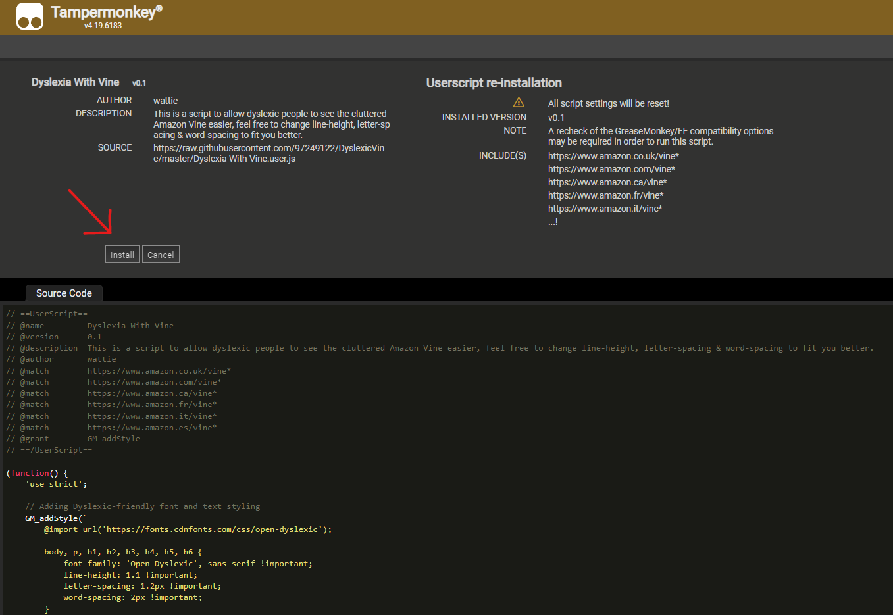

# DyslexicVine
This styling for Amazon Vine, specifically for people with dyslexia. This uses the OpenDyslexic font, please consider donating [here](https://opendyslexic.org).  if you like the font.  

## Installation

To use the scripts for this project, you will need to install Tampermonkey, which is a free browser extension.

### Prerequisites

- any Chromium-based browser like Google Chrome, Mozilla Firefox, or Opera / Opera GX.

### Install Tampermonkey

Tampermonkey is a userscript manager that allows you to manage and run userscripts. To install Tampermonkey on your browser, follow these steps:

#### Google Chrome and Chromium-based Browsers

1. Visit the [Chrome Web Store](https://chromewebstore.google.com/?hl=en).
2. Use the search bar to find "Tampermonkey".
3. Locate the Tampermonkey extension in the search results.
4. Click on 'Add to Chrome' to install the extension.
5. A pop-up window will appear detailing the permissions required by the extension. Review the permissions and if you agree, click 'Add extension'.

After installation, the Tampermonkey icon should appear in your browser's extension area, indicating that it is ready to use. Now you can proceed to add userscripts and enhance your browsing experience.

### Step 1: Installing Script 

1. Go to this link [here](https://raw.githubusercontent.com/97249122/DyslexicVine/master/Dyslexia-With-Vine.user.js) and click the "Install" button, sometimes it might show as "Reinstall" instead, click this anyways.
   

### Step 2: Save and Activate

1. To save the script, press `Ctrl + S` or click on the disk icon to save the script in Tampermonkey.
2. Once saved, the script should be active by default. If not, ensure the script is enabled in the Tampermonkey dashboard.

### Step 2: Reload Amazon Page

1. Navigate to the Amazon Vine webpage.
2. Simply reload the page by pressing `F5` or clicking the reload button in your browser.
3. The userscript should now be operational, and you should see the changes applied by `Dyslexic-vine.js`.

## Recommended Viewing Experience

To enhance readability for users with dyslexia, it is recommended to view [Vine Styling for Amazon](https://github.com/Thorvarium/vine-styling) in dark mode. The dyslexia-friendly font used tends to pop out more and provide a clearer contrast against a dark background

